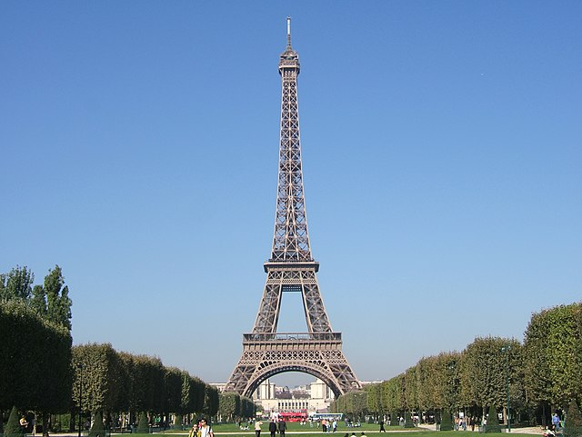
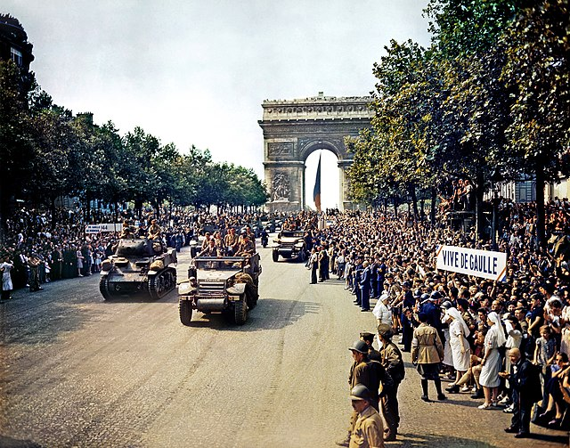
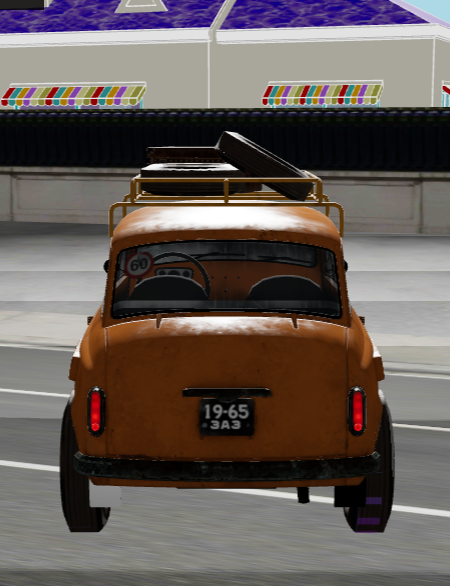
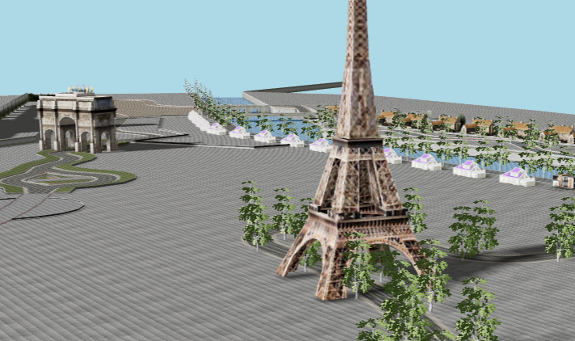
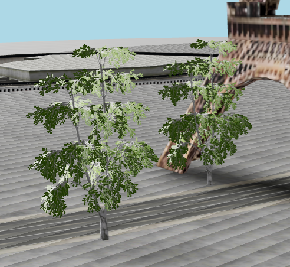
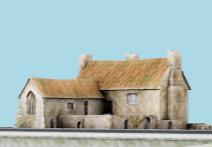
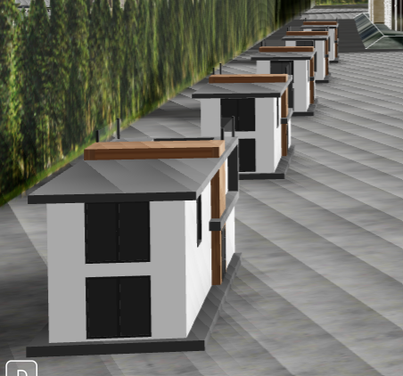
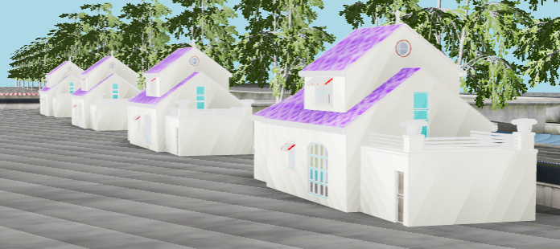
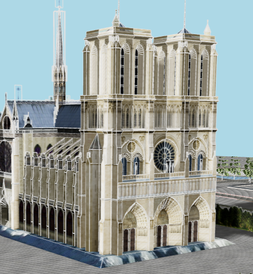

# Car Simulation

A 3D car simulation project for Computer Graphics course CS105.O22.KHCL by Group 15.


## Requirements

- NodeJS to run the program
- `git` to download this repository

## Usage Guide

### Installation

```bash
git clone https://github.com/hnthap/car-ride.git --depth=1
cd car-ride
npm install
```

### Run

```bash
npm run build
npm run preview
```

### Development Mode

```bash
npm run dev
```

## Voice Controls

The car simulation includes voice control functionality:

- **"Forward"** or **"Go"** - Move the car forward
- **"Backward"** or **"Back"** - Move the car backward  
- **"Left"** or **"Turn left"** - Turn the car left
- **"Right"** or **"Turn right"** - Turn the car right
- **"Faster"** or **"Speed up"** - Increase car speed
- **"Slower"** or **"Slow down"** - Decrease car speed
- **"Stop"** or **"Brake"** - Stop the car

Click the voice control button in the bottom-right corner to activate voice commands.

## Controls

### Keyboard Controls
- **W** - Move forward
- **S** - Move backward
- **A** - Turn left
- **D** - Turn right
- **Space** - Brake
- **R** - Reset car position
- **Enter** - Switch camera view (first/third person)

### Voice Controls
Use voice commands for hands-free control. The voice recognition system supports multiple command variations for better accuracy.

## Deployment

### Deploy to Netlify

This project is configured for easy deployment on Netlify:

1. **Connect your repository to Netlify:**
   - Go to [netlify.com](https://netlify.com)
   - Sign up/Login with your GitHub account
   - Click "New site from Git"
   - Choose your repository
   - Netlify will automatically detect the build settings

2. **Build settings (auto-detected):**
   - Build command: `npm run build`
   - Publish directory: `dist`
   - Node version: `18`

3. **Deploy:**
   - Click "Deploy site"
   - Your site will be live at `https://your-site-name.netlify.app`

### Manual Deployment

If you prefer to deploy manually:

```bash
# Build the project
npm run build

# The built files will be in the 'dist' folder
# Upload the contents of 'dist' to your hosting provider
```

### Environment Variables

No environment variables are required for this project.

## Features

- **3D Car Simulation** - Realistic physics-based car movement
- **Voice Controls** - Hands-free operation with speech recognition
- **Multiple Camera Views** - First and third-person perspectives
- **Interactive Environment** - Paris-themed landscape with landmarks
- **Responsive Design** - Works on desktop and mobile devices
- **Real-time Physics** - Accurate vehicle dynamics and collision detection

## Technology Stack

- **React 18** - Frontend framework
- **Three.js** - 3D graphics library
- **React Three Fiber** - React renderer for Three.js
- **React Three Cannon** - Physics engine integration
- **TypeScript** - Type-safe JavaScript
- **Vite** - Build tool and development server

## Credits

### Images

| Image | Description | Source | License |
| --- | --- | --- | --- |
|  | Movement controls | [*Ecctrl + Fisheye*](https://codesandbox.io/s/nvk9pf) | Not applicable |
|  | Eiffel Tower | [Tognopop (Wikimedia Commons)](https://commons.wikimedia.org/wiki/File:Eiffel_Tower_20051010.jpg) | [Public Domain](https://en.wikipedia.org/wiki/Public_domain) |
|  | Arc de Triomphe | [Jack Downey (Wikimedia Commons)](https://commons.wikimedia.org/wiki/File:Crowds_of_French_patriots_line_the_Champs_Elysees-edit2.jpg) | [Public Domain](https://en.wikipedia.org/wiki/Public_domain) |
|  | Notre-Dame de Paris | [Jebulon (Wikimedia Commons)](https://commons.wikimedia.org/wiki/File:Fl%C3%A8che_et_rosace_transept_sud_Notre-Dame_de_Paris.jpg) | [CC0 1.0](./LICENSES/cc0-1-0.txt) |

### 3D Models

| Model | Description | Source | License |
| --- | --- | --- | --- |
|  | Car | [Car Scene](https://skfb.ly/6uSoM) by toivo | [CC-BY 4.0](./LICENSES/cc-by-4-0.txt) |
|  | Terrain, roads, Eiffel Tower and Arc de Triomphe | [sport car racing paris](https://skfb.ly/oIME6) by amogusstrikesback2 | [CC-BY 4.0](./LICENSES/cc-by-4-0.txt) |
|  | Birch Tree | [Birch Tree](https://sketchfab.com/3d-models/birch-tree-aa842dffd9654d33b8b91170ce83c172) by evolveduk | [CC-BY 4.0](./LICENSES/cc-by-4-0.txt) |
|  | Regular house | [Preceptory and Dower House - game asset](https://sketchfab.com/3d-models/preceptory-and-dower-house-game-asset-50d31c70e44b4000b17d81ff0fbcdf98) by Andy Woodhead | [CC-BY 4.0](./LICENSES/cc-by-4-0.txt) |
|  | Regular house | [Modern Home](https://sketchfab.com/3d-models/modern-home-7054d2d8710b4213ad3857c1e37e57ec) by Ciolan-T. Sebastian | [CC-BY 4.0](./LICENSES/cc-by-4-0.txt) |
|  | Regular house | [Oggy House](https://sketchfab.com/3d-models/oggys-house-d65ef2f37773403b8f40cd9f49faec13) by 18sh Det Har Ar Hadeed NAUTTP | [CC-BY 4.0](./LICENSES/cc-by-4-0.txt) |
|  | Notre-Dame de Paris | [Notre-Dame de Paris](https://sketchfab.com/3d-models/notre-dame-de-paris-cbe2bbde869c4139912ce2cc35567d2c) by copybrian | [CC-BY 4.0](./LICENSES/cc-by-4-0.txt) |

## License

This project is licensed under the MIT License - see the LICENSE file for details.

## Contributing

1. Fork the repository
2. Create your feature branch (`git checkout -b feature/AmazingFeature`)
3. Commit your changes (`git commit -m 'Add some AmazingFeature'`)
4. Push to the branch (`git push origin feature/AmazingFeature`)
5. Open a Pull Request

## Support

If you encounter any issues or have questions, please open an issue on the GitHub repository.
